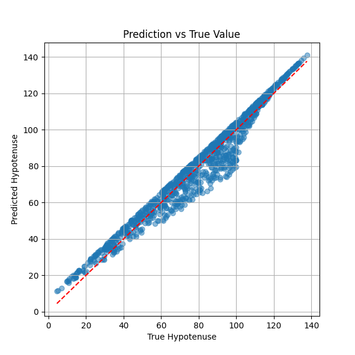

# Individual Assignment - ML for Robotic Fabrication  
## Index
  - [Overview](#overview) 
  - [Getting Started](#getting-started)
  - [Results](#results)
  - [Authors](#authors)
  - [References](#references)
  - [Credits](#credits)

## MRAC05(24/25): ML for Robotic Fabrication - Hypotenuse Predictor

This project explores the application of machine learning for a basic geometric task: predicting the hypotenuse of a right-angle triangle given the lengths of the two legs.  
The goal is to simulate a regression pipeline for robotic computation scenarios using synthetic data and scikit-learn.

## Overview

Using randomly generated values for triangle legs `a` and `b`, the model learns to predict the hypotenuse `c` using a Linear Regression model.  
The true values for `c` are calculated using the Pythagorean theorem:

```
c = sqrt(a² + b²)
```

This exercise reinforces the core ML workflow: data generation, training, evaluation, and documentation.

## Getting Started

### Prerequisites

Ensure the following are installed:
* Python 3.10+
* pip

### Dependencies

Install all required Python packages with:

```bash
pip install numpy pandas matplotlib scikit-learn
```

### Installing and Running

1. Generate the dataset:

```bash
python3 src/generate_data.py
```

2. Train and evaluate the model:

```bash
python3 src/train_model.py
```

This will output metrics and save a results plot to `data/pred_vs_real.png`.

## Results

The dataset is saved at:  
`data/triangles.csv`

### Evaluation

- **Model:** Linear Regression  
- **Mean Squared Error (MSE):** 35.4490  
- **R² Score:** 0.9574

### Prediction vs True Value Plot



## Authors
  - [Charlie Larraín](https://github.com/Clarrainl/) – Student, MRAC 2024/25

## References
- [Scikit-learn Documentation](https://scikit-learn.org/stable/)
- [Pythagorean Theorem - Wikipedia](https://en.wikipedia.org/wiki/Pythagorean_theorem)

## Credits
  - Adapted from MRAC GitHub Template by IAAC  
  - [Marita Georganta](https://www.linkedin.com/in/marita-georganta/) - Robotic Sensing Expert  

